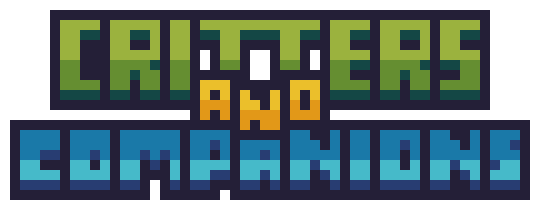

# Critters and Companions - Modern Fabric Port

<p align="center">
  
</p>

This repository contains an unofficial Fabric compatibility port of **Critters and Companions** for newer Minecraft versions. The port is maintained by Minecraft release line, with each supported line living on its own branch and release track.

Current supported release branches:

| Branch | Minecraft line | Latest port release | Java | Fabric Loader | Fabric API | GeckoLib | Forge Config API Port |
| --- | --- | --- | --- | --- | --- | --- | --- |
| `fabric/26.1.x` | `26.1.x` | `v26.1.2-0.2.3-fabric` | `25` | `0.19.2+` | `0.149.0+26.1.2` | `5.5+` | `26.1.4+` |
| `fabric/26.2.x` | `26.2.x` | `v26.2.0-0.1.2-fabric` | `25` | `0.19.3+` | `0.154.0+26.2` | `5.5.3+` | `26.2.1+` |

The original mod is a vanilla-style creature mod that adds new animals and companion interactions to the overworld.

Future Minecraft `26.x` lines should be treated as separate ports until they have been tested and released on their own branch.

## Content Highlights

The port keeps the original mod's vanilla-style creature design and updates the code/resources needed for newer Fabric, Minecraft, Java, and GeckoLib versions.

Included creature content covers the original roster and the newer official update content:

- Otters, koi fish, dragonflies, sea bunnies, shima enagas, ferrets, dumbo octopuses, jumping spiders, red pandas, and leaf insects.
- Ladybugs, roly-polies, snails, stag beetles, stick bugs, and weevils.
- Updated jumping spider variants and the arachnophobia-friendly built-in resource pack.
- Acorns, acorn hats, snail slime bottles, mud balls, roly-poly chest support, spawn eggs, recipes, loot hooks, sounds, animations, and language resources.

Recent port-specific work also includes configurable natural spawns, Spanish translations, GeckoLib 5 render fixes for flat model planes, spawn egg/model fixes, and crash fixes found during in-game testing.

## Configuration

The port uses the Fabric/Forge Config API Port setup already present in this project.

- `crittersandcompanions-common.toml` controls common gameplay options.
- `crittersandcompanions-spawns.toml` controls natural spawn entries, including biome or biome tag, weight, minimum group size, and maximum group size per entity.

Config changes are read on game startup, so users should close Minecraft, edit the TOML file, save it, and launch the game again.

## Attribution

This port is based on the original **Critters and Companions** project by Bonsai Studios and its contributors.

Original project links:

- CurseForge: https://www.curseforge.com/minecraft/mc-mods/critters-and-companions
- Source repository: https://github.com/bonsaistudi0s/CrittersAndCompanions

Public credits from the original project page:

- Josh / Joosh: art
- EterDelta: coding
- Scratchy: sound effects
- Lytho_: original Fabric port
- L2: Modded Omelet resource pack spawn egg textures adapted for this port

The public CurseForge team also lists possible_triangle, Lytho, AlexNijjar, CodexAdrian, EterDelta, and BonsaiStudios Mascot as project members.

All original design, assets, names, mobs, textures, animations, and gameplay concepts belong to the original authors and contributors. This repository is only a compatibility port for newer Minecraft/Fabric/Java targets.

## Porting Notes

This port was produced with assistance from **OpenAI Codex** through iterative local debugging and testing. The work focuses on updating the existing code and resources to run on newer Minecraft/Fabric targets rather than redesigning the mod.

Notable porting work includes:

- Updating Fabric, Minecraft, Java, GeckoLib, and Gradle configuration.
- Migrating entity rendering and GeckoLib resource paths.
- Updating item, block, loot table, recipe, resource-pack, and language resource formats for newer Minecraft versions.
- Fixing mixins and access patterns that changed in newer Minecraft mappings.
- Restoring item models, spawn egg models, translations, and the arachnophobia-friendly built-in resource pack.
- Preserving Fabric-only structure for this port while keeping compatibility with local helpers, tags, config files, and GeckoLib 5 patterns.
- Verifying core interactions such as taming, breeding, sitting, dragonfly armor, pearl necklace behavior, sea bunny slime collection, natural spawns, armor rendering, and relevant mob AI crashes found during testing.

## Building

Build the mod with:

```sh
sh ./gradlew build --no-daemon --console=plain
```

The Fabric jar is generated in:

```text
build/libs/
```

## Status

Public releases of this unofficial port are available on GitHub:

- https://github.com/BoyAxl/CrittersAndCompanions-Fabric-Port/releases

The current release tracks are:

- `fabric/26.1.x`: `v26.1.2-0.2.3-fabric`
- `fabric/26.2.x`: `v26.2.0-0.1.2-fabric`

The port has been tested in-game for startup, world creation, item rendering, selected recipes, entity rendering, natural spawning, spawn eggs, selected taming/breeding flows, and several core interactions. It should still be treated as experimental until broader gameplay coverage is completed.
